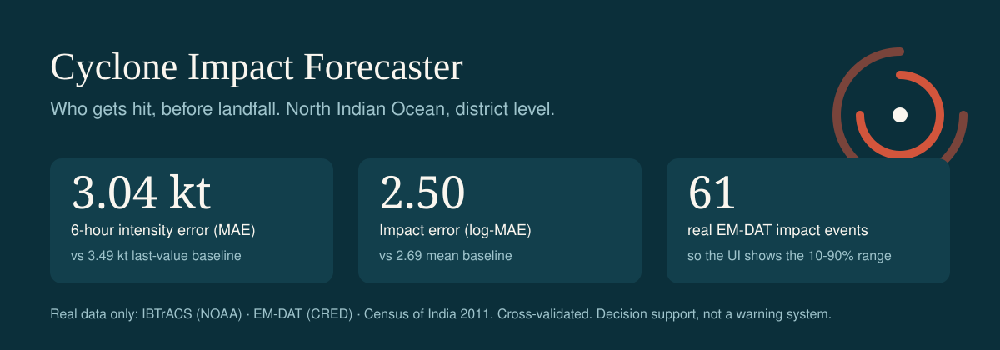
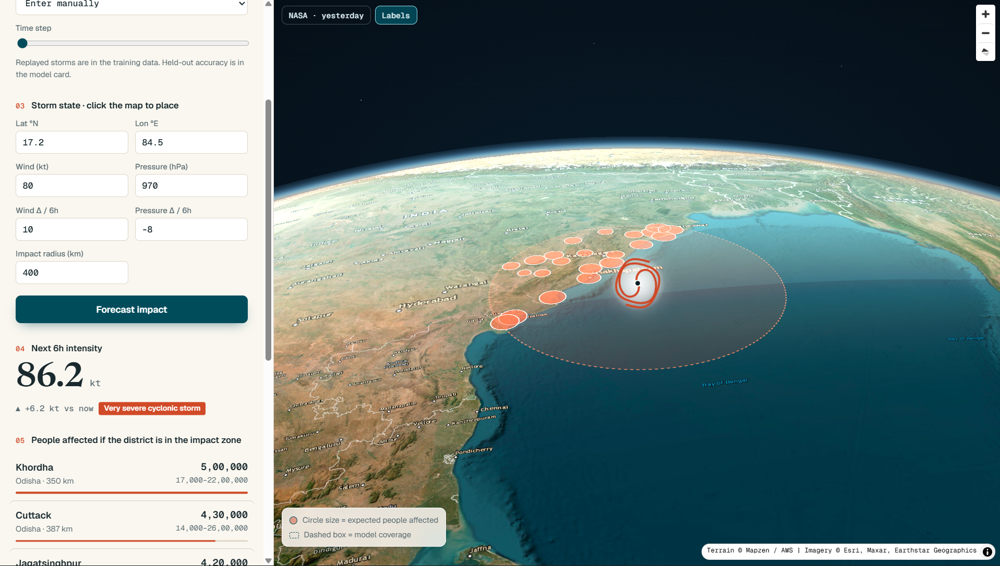

# Cyclone Impact & Infrastructure Vulnerability Forecaster

[](https://github.com/Divyansh0208/Cyclone/actions/workflows/ci.yml)
[](LICENSE)

**Live demo:** https://cyclone-forecaster-s015.onrender.com
(Free hosting sleeps when idle, so the first load can take up to a minute.)



*Example: a storm placed by hand at 17.2°N 84.5°E, 80 kt. The output is a relative ranking, and every number comes with its 10-90% range.*

Near-real-time forecast of North Indian Ocean cyclone intensity (XGBoost) and a relative ranking of people affected per
Indian district (2-parameter log-linear model on EM-DAT + Census 2011). FastAPI backend, MapLibre GL 3D satellite-globe
frontend. All data is real: IBTrACS (NOAA NCEI), EM-DAT (CRED), Census of India 2011.

> **Decision support, not a warning system.** Official warnings come from IMD (RSMC New Delhi).

## Results (cross-validated)

| | This model | Baseline |
|---|---|---|
| Next-6h intensity error (MAE) | **3.04 ± 0.20 kt** | 3.49 kt (last value) |
| Impact error (log-MAE) | **2.50 ± 0.41** | 2.69 (mean) |

- Intensity: storm-grouped 5-fold CV, better than the baseline in 5 of 5 folds. Grouping by storm keeps fixes of the same storm out of both train and test.
- Impact: 5-fold x 20 repeats on the log scale, better in about 78% of folds. Only 61 real damage events exist, so the gain is modest on purpose and the UI always shows the error band.

How the models work is in [ARCHITECTURE.md](ARCHITECTURE.md).

## Run
```bash
pip install -r requirements.txt
uvicorn app.main:app --port 8000          # http://localhost:8000
# or: docker build -t cyclone . && docker run -p 8000:8000 cyclone
```
Check the live source is reachable from your host before a demo:
`curl -sI https://www.ncei.noaa.gov/data/international-best-track-archive-for-climate-stewardship-ibtracs/v04r01/access/csv/ibtracs.ACTIVE.list.v04r01.csv`

The frontend loads map tiles and libraries from public CDNs, so the demo machine needs internet and a WebGL-capable browser
(current Chrome, Edge, Firefox or Safari).

## Frontend: 3D satellite globe
Single file, `frontend/index.html`, no build step. MapLibre GL 5.24 with globe projection.

- **Satellite globe:** Esri World Imagery on a 3D sphere with atmosphere glow, place-name labels and real terrain relief
  (AWS/Mapzen elevation tiles). Tilt with right-drag or the compass control.
- **NASA layer:** the "NASA · yesterday" toggle swaps in MODIS Terra true-colour imagery (NASA GIBS, previous complete UTC day)
  so real cloud systems are visible. The "Labels" toggle hides place names.
- **Scroll-driven camera:** on load the camera descends from orbit to the basin. Scrolling the sidebar then moves it: basin
  overview (live storms), tilted view (replay), storm close-up (storm state), and framing of the affected districts (results).
  Running a forecast or picking a live storm also frames the impact zone. Clicking a district in the ranking flies to it at a
  60° tilt.
- **Storm and impact layers:** a spinning cyclone marker sized by wind speed (draggable, or click the globe to place it), a
  geodesic impact-radius ring, the storm track, dashed model-coverage box, and district circles sized by expected people
  affected.
- **Accessibility:** `prefers-reduced-motion` disables all camera animation. Sidebar and inputs are fully keyboard-operable.
- **Mobile:** the globe stays pinned at the top while the panel scrolls beneath it.

Performance tip: if terrain plus globe is slow on an older GPU, delete the `terrain:{...}` line in the map style inside
`frontend/index.html`.

## Live data: what "real time" means here
`/api/v1/live` reads NOAA NCEI's IBTrACS **ACTIVE** file (JTWC provisional fixes for currently active storms), falling back to
the last-3-years file. NCEI rebuilds it about 3x/week, so latency is up to ~2 days: near-real-time, not live telemetry. The UI
shows the age of every fix. One shared fetch (15 min TTL, conditional GET), stale-if-error, never crashes the API. If no NI storm
is active the panel says so; replay of real historical storms and manual placement still work.

## API
| | |
|---|---|
| `GET /api/v1/live` | active NI storms with current state, track, age |
| `POST /api/v1/forecast` | storm state -> next-6h intensity + top-25 districts by expected affected (`radius_km` optional) |
| `GET /api/v1/status` | model metrics + provenance |
| `GET /healthz`, `/readyz` | liveness / readiness |

Interactive API docs are served at `/docs`.

Example:
```bash
curl -X POST http://localhost:8000/api/v1/forecast \
  -H "Content-Type: application/json" \
  -d '{"lat": 19.0, "lon": 86.5, "wind": 100, "pressure": 950, "wind_trend": 10, "pressure_trend": -8, "radius_km": 400}'
```

Env: `LIVE_URLS`, `LIVE_TTL_S` (900), `LIVE_MAX_AGE_H` (72), `DEFAULT_RADIUS_KM` (400), `CORS_ORIGINS`, `LOG_LEVEL`.

## Retrain (needs `pip install -r requirements-train.txt`)
```bash
python -m models.build_districts                                   # Census 2011 districts/states from public dataset
python -m models.train_intensity data/ibtracs.NI.csv              # -> models/intensity.json (+ .meta.json)
python -m models.build_emdat data/<emdat_export>.xlsx data/ibtracs.NI.csv   # -> data/emdat_joined.csv
python -m models.train_vulnerability data/emdat_joined.csv        # -> models/vulnerability.json
python -m models.export_storms data/ibtracs.NI.csv                # -> frontend/storms.json (replay)
python -m pytest -q
```
IBTrACS NI: NCEI `.../v04r01/access/csv/ibtracs.NI.list.v04r01.csv`. EM-DAT: public.emdat.be (Tropical cyclone, India; not redistributed here, so download your own export).

## Data and imagery credits
- Cyclone tracks: IBTrACS, NOAA NCEI (JTWC provisional fixes for live storms).
- Impact history: EM-DAT, CRED / UCLouvain. Population and area: Census of India 2011.
- Basemap imagery: © Esri, Maxar, Earthstar Geographics. Cloud imagery: NASA GIBS (MODIS Terra).
- Terrain: Mapzen / AWS Terrain Tiles. Map engine: MapLibre GL JS.

## Known limits (stated in the UI too)
- Impact model learned from whole-event totals with n=61: modest gain over baseline, wide range. Use for relative ranking.
- No track/landfall forecast: the same predicted wind is applied to every district inside the radius.
- Winds are JTWC 1-min sustained; the IMD category scale is 3-min, so categories are approximate.
- Census 2011 is 15 years old; a few post-2011 districts are missing.
- Globe imagery comes from free public tile servers with no uptime guarantee. Offline or blocked networks show a blank globe;
  the forecast API still works. The NASA layer has black gaps between satellite passes.

## Roadmap
Track and landfall forecast, IMD warning integration, shelter and hospital layers, newer population data. See the
[open issues](https://github.com/Divyansh0208/Cyclone/issues); ones labelled `good first issue` are a good place to start.

## Contributing
Contributions are welcome. Please read [CONTRIBUTING.md](CONTRIBUTING.md) first: real data only, honest uncertainty, and no
licensed raw data in the repo.

## License
[MIT](LICENSE). Data sources keep their own licences and terms (see credits above).
